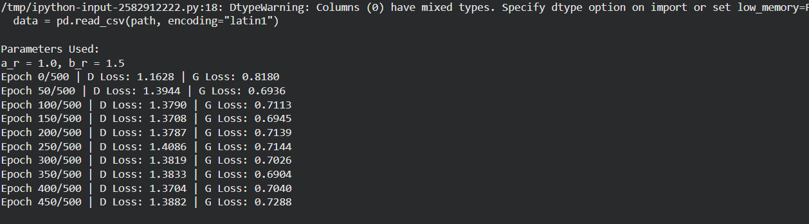
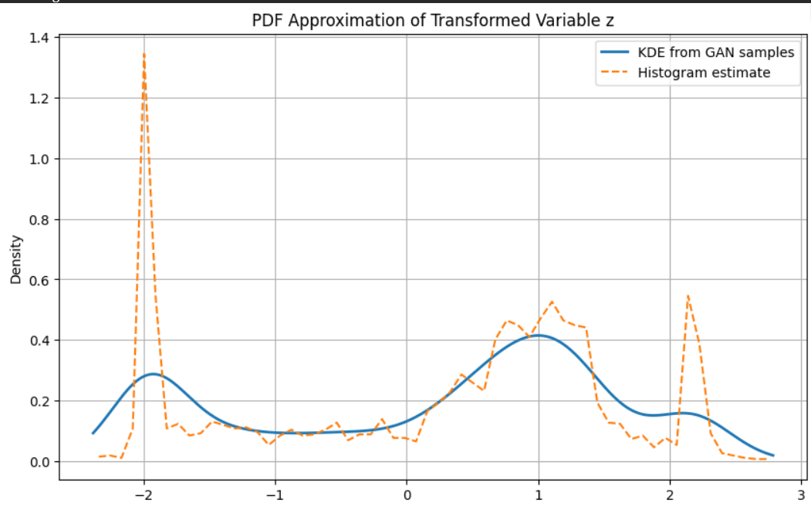

# 📘 Probability Density Function Modeling from NO₂ Data

This project estimates the **Probability Density Function (PDF)** of NO₂ concentration data using two complementary strategies:

1. Deep generative learning (GAN-inspired sample modeling)  
2. Parametric non-linear density fitting  

The workflow emphasizes data transformation, distribution learning, and density visualization using both data-driven and analytical techniques.

---

# 🔹 Project A: Sample-Based PDF Learning with GAN

## 🧠 Workflow

Data Loading  
→ Feature Selection (`no2`)  
→ Cleaning & Scaling  
→ Non-Linear Feature Mapping  
→ Generator–Discriminator Training  
→ Synthetic Sample Generation  
→ Density Estimation & Plotting  

---

## 📂 Dataset

- File: `data.csv`  
- Feature Used: `no2`  
- Preprocessing:
  - Missing values removed
  - Values scaled to a bounded range for stable transformation

---

## 🔄 Feature Mapping

To enrich distribution structure, values are transformed using:

Where:
- `x` = normalized NO₂ values  
- `a`, `b` = tunable shape parameters  

This mapping introduces controlled non-linearity and multi-modal behavior.

---

## 🤖 Generative Density Learning

A lightweight GAN-style model is trained on the transformed samples:

- Generator learns to produce realistic transformed values  
- Discriminator evaluates real vs synthetic samples  
- Training converges toward distribution matching  

Synthetic samples from the generator are then used for density estimation.

---

## 📊 Density Approximation Methods

The learned distribution is visualized using:

- Normalized histograms  
- Kernel Density Estimation (KDE)  
- Sample-based smooth PDF curves  

---

## 🎯 Goals

- Learn density without assuming a fixed distribution  
- Capture complex shapes from transformed data  
- Generate synthetic samples that follow the learned distribution  
- Visualize smooth PDFs from generated data  

---

## 📈 Observations

- Generated samples closely follow transformed data trends  
- KDE smoothing provides stable PDF visualization  
- Model captures skew and spread introduced by mapping  

---

# 🔹 Project B: Parametric Non-Linear PDF Fitting

## 🧠 Workflow

Data Loading  
→ Feature Selection (`no2`)  
→ Same Non-Linear Mapping  
→ Histogram Density Extraction  
→ Parameter Optimization  
→ Analytical PDF Construction  
→ Parameter Reporting  

---

## 🔄 Transformation Consistency

The identical mapping is reused:

This keeps both approaches directly comparable.

---

## 📐 Analytical Density Model

We fit a Gaussian-like exponential quadratic form:

Parameters learned from data:

- μ — center location  
- λ — spread/precision factor  
- c — scaling constant  

Parameters are estimated via curve fitting on empirical density.

---

## 🎯 Goals

- Fit a closed-form density model  
- Estimate optimal parameters from transformed data  
- Construct an interpretable PDF equation  
- Output learned parameter values  

---

## 📈 Observations

- Parametric curve provides smooth global approximation  
- Strong fit near central mass of distribution  
- Less flexible in highly irregular regions (expected behavior)

---

# ✅ Result

# ✅ Summary

This work presents two PDF estimation paths from environmental NO₂ data:

- **Sample-driven generative modeling** for flexible density learning  
- **Parametric non-linear fitting** for interpretable analytical density  

Together, they illustrate the tradeoff between flexibility and interpretability in probability density estimation.
